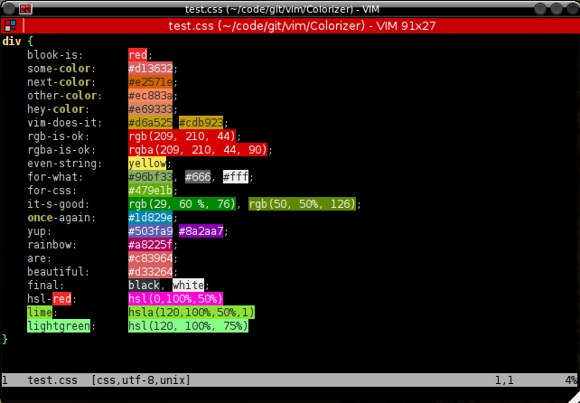

Colorizer
=========
> A plugin to color colornames and codes

This plugin is based on the css_color plugin by Nikolaus Hofer. The idea is to highlight color names and codes in the same color that they represent.

The plugin understands the W3-Colors (used for CSS files for example), the Color names from the X11 Window System and also codes in hex notation, like #FF0000 (which represents Red in the RGB color system). Additionally, it supports the CSS color specifications, e.g. rgb(RR,GG,BB) color representation in either absolute or percentage values and also the HVL Color representation like hvl(H,V,L)

It works best in the gui version of Vim, but the plugin also supports 256 and 88 color terminals and translates the colors to those supported by the terminal. 16 and 8 color terminals should work theoretically too, but hasn't been widely tested. Note, that translating the colors to the terminal might impose a performance penalty, depending on the terminal type and the number of matches in the file.

Installation
---

Use the plugin manager of your choice. Or download the [stable][] or [unstable][] version of the plugin, edit it with Vim (`vim Colorizer.vmb`) and simply source it (`:so %`). Restart and take a look at the help (`:h Colorizer`)

[unstable]: https://raw.github.com/chrisbra/color_highlight/master/Colorizer.vmb
[stable]: http://www.vim.org/scripts/script.php?script_id=3963

Usage
---
Once installed, take a look at the Colorizer help at `:h Colorizer`

License & Copyright
-------

Based on work by Nikolaus Hofer. Further developed by Christian Brabandt. 
The Vim License applies. See `:h license`

2009, 2010, 2011, 2012, 2013 by Christian Brabandt

__NO WARRANTY, EXPRESS OR IMPLIED.  USE AT-YOUR-OWN-RISK__
